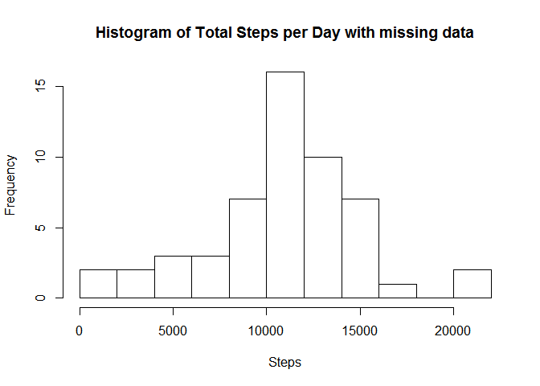
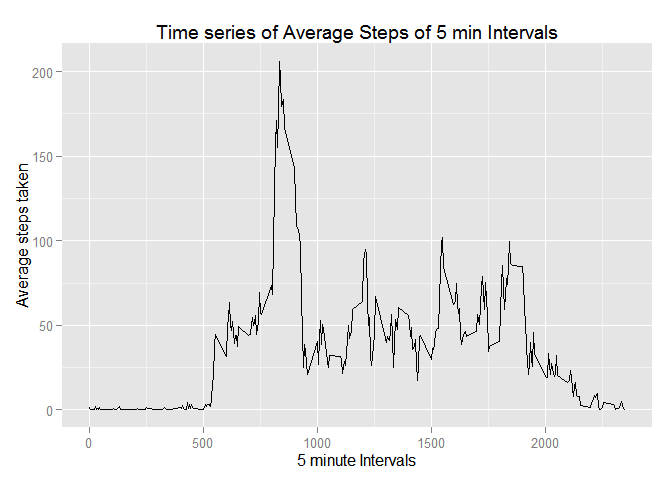
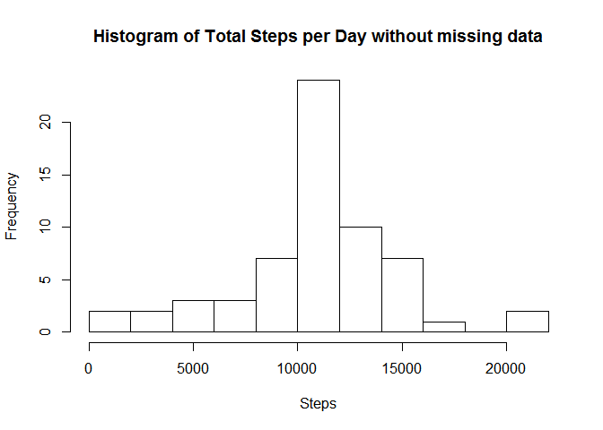
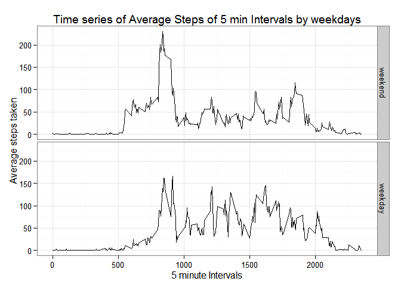

# Reproducible Research: Peer Assessment 1


## Loading and preprocessing the data  

```r
require(dplyr,quietly=TRUE, warn.conflicts=FALSE)
```

```
## Warning: package 'dplyr' was built under R version 3.1.3
```

```r
require(ggplot2,quietly=TRUE)
activity <- read.csv("activity.csv")
#remove rows with missing data
mydf <- filter(activity, !is.na(steps))
#group by date and summarise to get total steps per day
by_date <- group_by(mydf, date)
dfbyday <- summarise(by_date, totperday=sum(steps))
hist(dfbyday$totperday, breaks=10, xlab="Steps", main="Histogram of Total Steps per Day with missing data")
```

 

## What is mean total number of steps taken per day?


```r
themean <- format(mean(dfbyday$totperday))
median(dfbyday$totperday)
```

```
## [1] 10765
```

The mean total number of steps taken per day is 10766.19   

## What is the average daily activity pattern?
The average daily activity pattern can be seen in the graph below which shows the average number of steps taken 
over the days for each 5 minute time interval  

```r
mydata <- transform(mydf, interval = as.factor(interval))
by_int <- group_by(mydata,interval)
dfbyint <- summarise(by_int,avgsteps = mean(steps))

#transform interval back to num to plot on graph easier
dfbyint <- transform(dfbyint, interval = as.numeric((levels(interval))))
#5 min interval which contains the maximum number of steps across days
maxint <- dfbyint[dfbyint$avgsteps==max(dfbyint$avgsteps),]
maxint
```

```
##     interval avgsteps
## 104      835 206.1698
```

```r
#plot time series graph
glineplot <- ggplot(data=dfbyint, aes(interval, avgsteps,group=1))+geom_line() + labs(title="Time series of Average Steps of 5 min Intervals",x="5 minute Intervals", y="Average steps taken")
print(glineplot)
```

 
  
## Imputing missing values  
The strategy I used for filling in the missing values, was to take the mean for the 5 minute intervals and insert for the corresponding missing values in dataset, using a lookup vector of mean time intervals  


```r
#number of missing data values
sum(is.na(activity))
```

```
## [1] 2304
```

```r
activity2 <- activity
#make lookup vector for avg steps, needs to be same length as activity vector
lu_meansteps<- data.frame(dfbyint, 1:17568) 

#change all NAs to the average mean of corresponding time interval
act2<- within(activity2,steps <-ifelse(is.na(steps),lu_meansteps$avgsteps[lu_meansteps$interval==activity2$interval],steps))

mby_date <- group_by(act2, date)
dfmbyday <- summarise(mby_date, totperday=sum(steps))
#plot histogram of frequency of total steps over days
hist(dfmbyday$totperday, breaks=10, xlab="Steps", main="Histogram of Total Steps per Day without missing data")
```

 

```r
#get mean and median to compare with dataframe that removed all missing values
mean(dfmbyday$totperday)
```

```
## [1] 10766.19
```

```r
median(dfmbyday$totperday)
```

```
## [1] 10766.19
```

## Are there differences in activity patterns between weekdays and weekends? 


```r
#convert date factors to Dates   check format of posix
act2 <- transform(act2,date = as.POSIXlt(date))

#create new factor variable for days
act2 <- mutate(act2,daytype = factor((weekdays(date) %in% c("Saturday","Sunday")),labels=c("weekend","weekday"))) 

#act2 <- transform(act2, interval = as.factor(interval))
act2 <- transform(act2, date = as.character(date))
act2by_int <- group_by(act2,interval,daytype)
sum_act2byint <- summarise(act2by_int,avgsteps = mean(steps))

#plot paneled line graphs of average steps taken over time intervals grouped by weekday and weekend
g <- ggplot(data=sum_act2byint, aes(interval, avgsteps,group=1))+geom_line()
plot <- g + facet_grid(daytype~.)+theme_bw()+ labs(title="Time series of Average Steps of 5 min Intervals by weekdays",x="5 minute Intervals", y="Average steps taken") 
print(plot)
```

 

The differences in activity patterns between steps taken in weekdays and weekends can be seen in the graph above with more steps being taken during the weekend over the 5 minute intervals, and during the week. 


